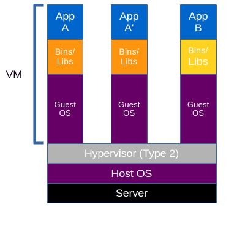
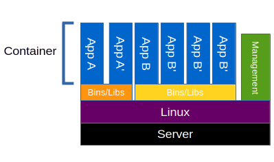
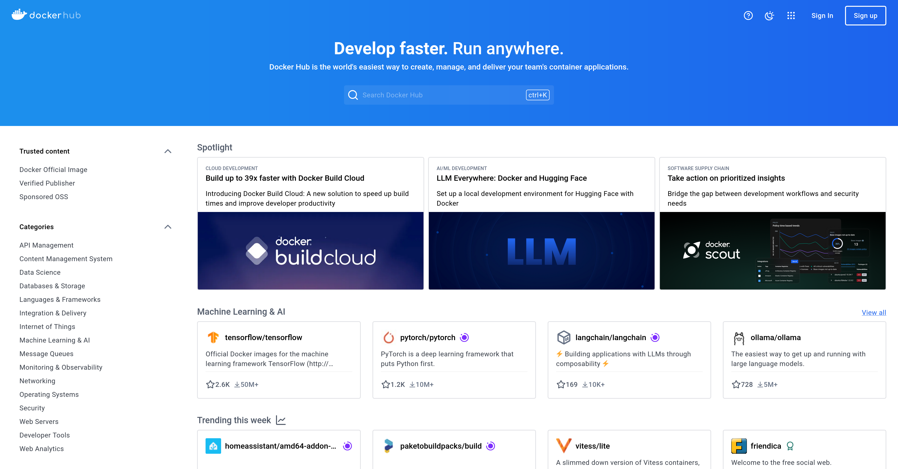
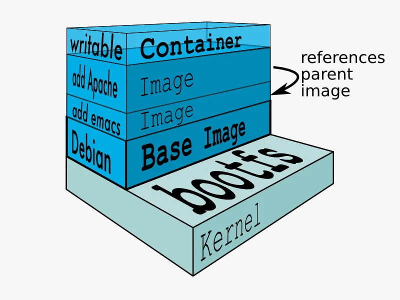
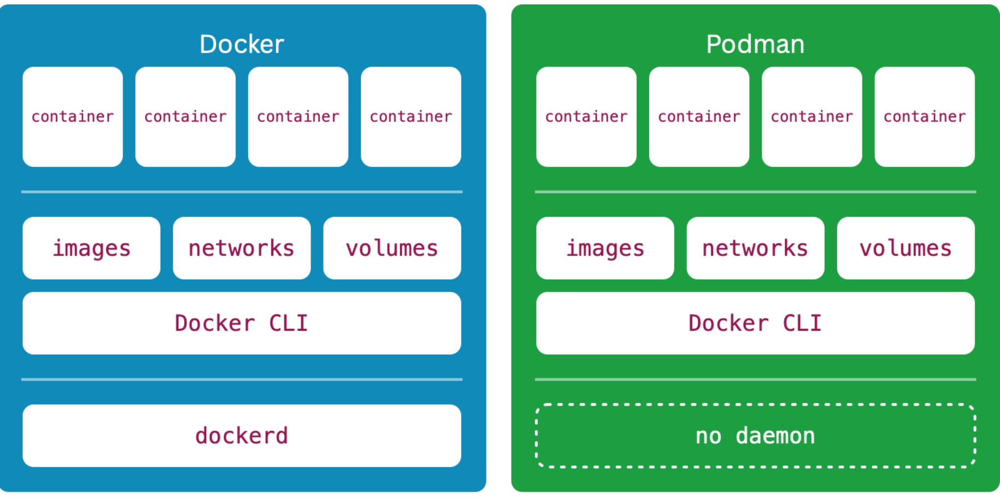
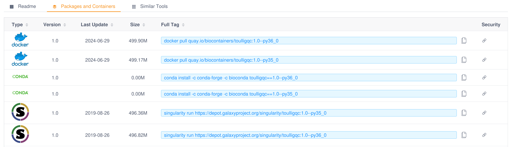

## Containers 


2025-11-25

- Laurent Jourdren
- Imane Messak
- Baptiste Rousseau

::: footer

 <p xmlns:cc="http://creativecommons.org/ns#" >This work is licensed under <a href="http://creativecommons.org/licenses/by-sa/4.0/?ref=chooser-v1" target="_blank" rel="license noopener noreferrer" style="display:inline-block;">CC BY-SA 4.0</a></p>
:::

## What is a container?

Operating system–level virtualization (container) is a **virtualization method** where the kernel of an operating system allows for **multiple isolated user space instances**, instead of just one.

*Source: Wikipedia*

## Kernel mode vs. user mode {.smaller}

With an oversimplification, an operating system can be divided in two parts:

- **Kernel mode** that provide an abstraction of the hardware, process, and memory management
- **User mode** where application are running

{ height=30\% width=30\% }
*Source: Wikipedia*

## Hardware virtualization vs. OS virtualization {.smaller}

::: columns

:::: {.column width=50%}
**Virtualization**

{ height=50% width=50% }

Examples:

- VMWare (1999)
- VirtualBox
- KVM (Linux)
- HyperV (Windows WSL2)
- Hypervisor Virtualization Framework (macOS)
::::

::: {.fragment}
:::: {.column width=50%}
**Containerization**

{ height=90% width=90% }

Examples:

- *chroot* (1982)
- *FreeBSD Jail* (2000)
- *Linux LXC* (2008)
- **Docker** (2013)
- Singularity (2015)
- PodMan (2018)
- Apptainer (2021)
::::

:::
:::

## Container Pro/Con {.smaller}

**Pros**

- Can **mix Linux distributions** and versions (e.g., Ubuntu and CentOS)
- OS virtualization is **faster** (little or no overhead) than Hardware virtualization
- **No boot time** with OS virtualization
- Can run a container inside a virtual machine

::: {.fragment}

**Cons**

- Container must run the **same kernel** as the host, cannot mix OS (e.g., Windows and Linux)
- No RAM snapshot

:::

## Docker

In the next slides, we will see how containerization works using **Docker**, which **defined how modern containerization works** in 2013.

Moreover, Apptainer can use Docker images and Docker Hub as repository for images.

{ height=40\% width=40\% }

::: {.fragment}
::: columns
:::: {.column width=50%}
**Open Source:**

- Docker CLI
- Docker Compose
- containerd
- runC
::::

:::: {.column width=50%}
**Closed Source/Freemium/Paid subscription:**

- Docker Desktop
- Docker Hub images storage
- Docker Hub advanced features (Pro, Team, and Business plans)
::::
:::
:::

## Same kernel on "host" and in the container

Information about the host:

```bash
$ cat /etc/os-release | grep '^VERSION='
VERSION="24.04.3 LTS (Noble Numbat)"
$ uname -rv
6.14.0-29-generic #29~24.04.1-Ubuntu SMP PREEMPT_DYNAMIC Thu Aug 14 16:52:50 UTC 2
```

::: {.fragment}
Information about a CentOS 7 container:

```bash
$ docker run centos:7 cat /etc/os-release | grep -e '^VERSION='
VERSION="7 (Core)"
$ docker run centos:7 uname -rv
6.14.0-29-generic #29~24.04.1-Ubuntu SMP PREEMPT_DYNAMIC Thu Aug 14 16:52:50 UTC 2
```

:::

## Container cannot work on another OS/arch

Attempt to run a Windows container on Linux:

```bash
$ docker run mcr.microsoft.com/windows:ltsc2019
Unable to find image 'mcr.microsoft.com/windows:ltsc2019' locally
ltsc2019: Pulling from windows
docker: no matching manifest for linux/amd64 in the manifest list entries.
See 'docker run --help'.
```

::: {.fragment}
Attempt to run an ARM64 Linux container on x86-64:

```bash
$ docker run arm64v8/ubuntu:24.04
WARNING: The requested image's platform (linux/arm64/v8) does not match the detected host
platform (linux/amd64/v3) and no specific platform was requested
exec /bin/bash: exec format error
```

:::

## But, wait I can use my favorite Linux images on my new MacBook? 🤔

::: {.fragment}
When using Docker Desktop on a Mac (or Windows), you automatically:

- Launch a **Linux VM** on your Mac
- Configure access to filesystem and network of the Linux VM
- and macOS **translate x86-64 instructions** into ARM64 (≈ emulation)
:::

::: {.fragment}

⚠️ The macOS x86-64 to ARM64 translation layer (Rosetta) **will be removed from macOS** with version 28 **in 2027**.
:::

## Image vs. container

- In programming oriented object analogy:
  - Image ≈ Class
  - Container ≈ Object

::: {.fragment}

- Modifications of running images are lost after the end of the container

```bash
$ docker run ubuntu:24.04 touch /toto
$ docker run ubuntu:24.04 ls /toto
ls: cannot access '/toto': No such file or directory
```

→ Container images are **immutable**.
:::

## Launching a Docker container (1)

- Launch a command in a container with the `docker run` command

```bash
$ docker run ubuntu:24.04 ps -aux
USER         PID %CPU %MEM    VSZ   RSS TTY      STAT START   TIME COMMAND
root           1  8.3  0.0   7808  3920 ?        Rs   12:35   0:00 ps -aux
```

::: {.fragment}

- Launch Bash in interactive mode (`-t -i` options)

```bash
$ docker run -t -i ubuntu:24.04 bash
root@c8e01ed654df:/# ps -aux
USER         PID %CPU %MEM    VSZ   RSS TTY      STAT START   TIME COMMAND
root           1  0.1  0.0   4560  3724 pts/0    Ss   09:31   0:00 bash
root           8 33.3  0.0   7808  3920 pts/0    R+   09:31   0:00 ps -aux
```

:::
::: {.fragment}

- Mount */tmp* in */root* of the container (`-v` option)

```bash
$ docker run -t -i -v /tmp:/root ubuntu:24.04 bash
```

:::
::: {.fragment}

- Run as non-root user in container (`-u` option)

```bash
$ docker run -t -i -v /tmp:/root -u 1001:1001 ubuntu:24.04  bash
```

:::

## Launching a Docker container (2)

- Launching Bash in interactive mode as user in the current directory (`-w` option)

```bash
$ docker -ti \
         --rm \
         -v "$(readlink -f .):$(readlink -f .)" \
         -w "$(readlink -f .)" \
         -u $(id -u):$(id -g)
         ubuntu:24.04 \
         bash
```

## Docker image repositories (1)

{ width=90% }

Container images (e.g., Docker images) can be stored in **remote repositories**.

The main Docker repository is hosted by Docker Inc. (Docker Hub [https://hub.docker.com](https://hub.docker.com)).

## Docker image repositories (2)

However, there are **many** Docker Hub repositories **alternatives**:

- GitHub/GitLab container registry (Authentication is required)
- Amazon Elastic Container Registry
- Red Hat Quay
- **Biocontainer** ([https://biocontainers.pro](https://biocontainers.pro)), free, use Red Hat Quay for its infrastructure
- …
- **Private repositories** (self-hosted, easy to deploy as it is just a Docker container to start)
  - Launching a private Docker repository

```bash
$ docker run -d -p 5000:5000 --restart=always --name mon-registry registry:2
```

## Creating an image from an existing container

- Create a container and change the content of the filesystem

```bash
$ docker run -ti ubuntu:24.04 bash
root@4c15d4118b4f:/# echo "Hello world!" > /hello.txt
root@4c15d4118b4f:/# exit
exit
```

::: {.fragment}

- Show the changes on the filesystem

```bash
$ docker diff 4c15d4118b4f
A /hello.txt
C /root
A /root/.bash_history
```

:::

::: {.fragment}

- Commit the changes to a new Docker image

```bash
$ docker commit 4c15d4118b4f anf/bibon:0.0.1
sha256:4b682bf8155fdc51466ed6eec9a000511502016eed7115d68e321e1f7b8c51be
```

:::

## Push the created image on a repository

- Push the new image on the Docker hub (require an account on Docker Hub)

```bash
$ docker push anf/bibon:0.0.1
The push refers to repository [docker.io/anf/bibon]
b095a460bd9e: Layer already exists
5f94273e386b: Layer already exists
0.0.1: digest: sha256:822ce5c0fc67586ec203daab7b9010a2d135b8a617355eb69e9d78c334f3e784 size: 736
```

::: {.fragment}

- Push the new image on alternate repository

```bash
$ docker tag anf/bibon:0.0.1 mydockerrepo.org:5000/anf/bibon:0.0.1
$ docker push myrepo.org/anf/bibon:0.0.1
```

:::

## Docker image layers

{ height=80\% width=80\% }

*Source: Ridwan Shariffdeen*

## Dockerfile

- Create a "**Dockerfile**" file in an empty directory:

```Dockerfile
FROM ubuntu:24.04

ARG VERSION=0.3.33
RUN apt update && \
    DEBIAN_FRONTEND=noninteractive apt install --yes \
                    python3 \
                    python3-pip && \
    apt clean && \
    rm -rf /var/lib/apt/lists/*
RUN pip3 install "pod5==$VERSION"
```

::: {.fragment}

- Build the image

```bash
$ docker build -t anf/pod5:0.3.2 .
```

- Push the new image on the Docker hub

```bash
$ docker push anf/pod5:0.3.2
```

:::

## Docker advanced options

- `--name` define a name for the container
- `--rm` automatically remove the container when it exits
- `-e` define an environment variable in container
- `-p` define a port mapping between host and container

```bash
$ docker run --rm \
           --name postgresql \
           -e POSTGRES_PASSWORD=pgpassword \
           -e POSTGRES_USER=pguser \
           -e POSTGRES_DB=my_db \
           -p 5432:5432 \
           postgres:16
```

- `--gpus` allow usage of GPUs by the container

```bash
$ docker run --rm --gpus all nvidia/cuda:11.8.0-cudnn8-runtime-ubuntu18.04 nvidia-smi
GPU 0: NVIDIA RTX A6000 (UUID: GPU-0f985e54-0059-e6eb-20ba-8920319a4f24)
GPU 1: NVIDIA RTX A6000 (UUID: GPU-c3118007-b9fc-2d85-997a-92cd00f18cca)
```

## Docker useful commands

- list all containers (even if they are stopped)

```bash
$ docker ps -a
```

- List images on the system

```bash
$ docker images
```

- Remove a container

```bash
$ docker rm 4c15d4118b4f
```

- Remove an image

```bash
$ docker rmi postgres:16
```

- `top` like command for Docker containers

```bash
$ docker stats
```

## Docker vs. Podman

**Podman** is free software alternative to Docker made by Red Hat and is usually faster at startup than Docker as it does **not use a Daemon** on the computer.

One of Podman's greatest advantages is its **CLI compatibility with Docker**.

```
$ alias docker=podman
```

You can run `docker pull`, `docker run`… but launch Podman instead of Docker.

Podman **can work in rootless mode** to be more secured (Docker can now also work in rootless mode).
Podman and Docker use the same underlying library (runC) to execute containers.

You need to start a **Podman service** if you want to use the **Docker API** that it used by many programming language libraries.

{ height=50\% width=50\% }

*Source: kevsrobots.com*

## Singularity/Apptainer

What is the differences between **Singularity** and **Apptainer**:

- SingularityPro: commercial software by Sylabs.
- SingularityCE: open source Singularity supported by Sylabs.
- Apptainer: open source Singularity, renamed in 2021 and hosted by the **Linux Foundation**.

{ height=20\% width=20\% }
{ height=37\% width=37\% }
{ height=20\% width=20\% }

## Apptainer (1)

**Singularity (and Apptainer)** has been developed to bring containers and reproducibility to high-performance computing (HPC) world, as Docker required to be root at start of container.
The other features of Singularity/Apptainer are:

- Easier integration with resource managers (like SLURM…) as it runs as a regular application.
- **Single-file** based container **images** (no images and container storage in */var/lib/docker*).
- Preserves the permissions in the environment.
- **Less starting overhead** than with Docker/Podman (No Daemon).

{ height=20\% width=20\% }

## Apptainer (2)

- Executing the cowsay command using Apptainer

```bash
$ apptainer exec lolcow_latest.sif cowsay moo
 _____
< moo >
 -----
        \   ^__^
         \  (oo)\_______
            (__)\       )\/\
                ||----w |
                ||     ||
```

- Launch a container in interactive mode

```bash
$ apptainer shell /tmp/Debian.sif
Apptainer/Debian.sif>
```

::: {.fragment}

- Use the `--bind` option to mount a directory into the container

```bash
$ apptainer exec --bind /data:/mnt my_container.sif ls /mnt
```

:::

## Docker vs. Singularity/Apptainer (3)

- Run a Docker image using Apptainer.

```bash
$ apptainer run --containall docker://alpine
```

**Note:** The `--containall` option allow option to isolate the container from the host. It is very useful with Conda containers to avoid using the Conda installation of the host inside the container.

## Apptainer vs. docker

By default, with Apptainer when you execute a program in a container:

- Apptainer bind mounts `$HOME` (e.g. `/home/$USER`), `~/tmp`, and `$PWD` into your container at runtime.
- the user is the same as outside the container (with Docker the default user is root)

::: {.fragment}
Example:

- Launching Bash in interactive mode as user in the current directory (Docker version)

```bash
$ docker -ti \
         --rm \
         -v "$(readlink -f .):$(readlink -f .)" \
         -w "$(readlink -f .)" \
         -u $(id -u):$(id -g)
         ubuntu:24.04 \
         bash
```

- Launching Bash in interactive mode as user in the current directory (Apptainer version)

```bash
$ apptainer shell docker://ubuntu:24.04 bash
```

:::


## Bioconda and Biocontainers (1)

**Bioconda** is a package repository that contains **thousands of software packages** related to biomedical research using the conda package manager.

It is open-source, and you can contribute to it on GitHub: [https://github.com/bioconda/bioconda-recipes](https://github.com/bioconda/bioconda-recipes)

{width=25%}

::: {.fragment}

In addition, Bioconda packages can be automatically **converted in Docker images** with the [Biocontainers](https://biocontainers.pro/) project.

{width=8%}
:::

::: {.fragment}

Biocontainer images are the default images used by [NF-core](https://nf-co.re/) and [Snakemake wrappers](https://snakemake-wrappers.readthedocs.io).

|   |   |
|:-:|:-:|
|{width=50%}|{width=50%}|
:::

## Bioconda and Biocontainers (1)

{ height=100\% width=100\% }


## Conclusion (1)

|               | **PROS**                                                                                                              | **CONS**                                                                                                                                                                                                               |
|---------------|-----------------------------------------------------------------------------------------------------------------------|------------------------------------------------------------------------------------------------------------------------------------------------------------------------------------------------------------------------|
| **Conda**     | - Lightweight installation<br/>- No need to be root<br/>- Public channels<br/>- Source for Docker/Apptainer containers | - There can be issues installing “old” packages 2 or 3 years after their creation (if dependencies have changed). Packages in Conda-forge and Bioconda are more durable<br/>- A lot of tiny files<br/>- No isolation with base system (security, reproducibility)|
| **Docker**    | - Portable<br/>- Public hub<br/>- Can be used by Singularity<br/>- Comes with the OS | - Not compatible with the HPC infrastructure<br/>- Rather heavy to install, need root grants<br/>- Needs a daemon<br/>- Security issues/concerns<br/>- Virtualization layer required for executing Linux images on Windows/macOS (Docker Machine or Virtualization tools) |
| **Apptainer** | - Compatible with HPC (non root, run as a binary)<br/>- Compatible with Docker image format<br/>- Comes with the OS | - Doesn’t use the same layer system as Docker<br/>=> heavier on the filesystem<br/>- No stable shared repository (yet)<br/>- It’s a deadlock that can’t be exported<br/>- Not well integrated on macOS<br/>- Virtualization layer required for executing Linux images on Windows/macOS|

*source : Julien Seiler and Gildas Le Corgillé*

## Conclusion (2)


To conclude, for **reproducibility** and **workflow sharing**, it is better to use (by order of preference) for dependency packaging:

1. **Containers**
   1. Singularity or Podman (Docker like without daemon, rootless mode)
   2. Docker
2. Conda
3. Environment Modules
4. No packaging of dependencies (can work with some script of static executables)


## Additional slides

## Useful Docker Commands (1)

Fetch logs from a container

```bash
docker logs <container_id>
```

Follow logs

```bash
docker logs -f <container_id>
```

Copy files between host and container

```bash
docker cp <container_id>:/path/in/container /host/path
```

```bash
docker cp /host/path <container_id>:/path/in/container
```

## Useful Docker Commands (2)

Start an existing container

```bash
docker start <container_id>
```

Restart a container

```bash
docker restart <container_id>
```

Clean unused objects

```bash
docker system prune
```

Clean all unused images and containers

```bash
docker system prune -a
```